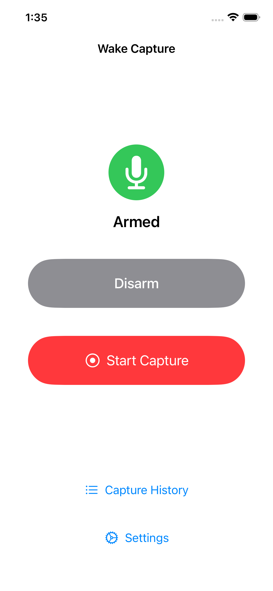
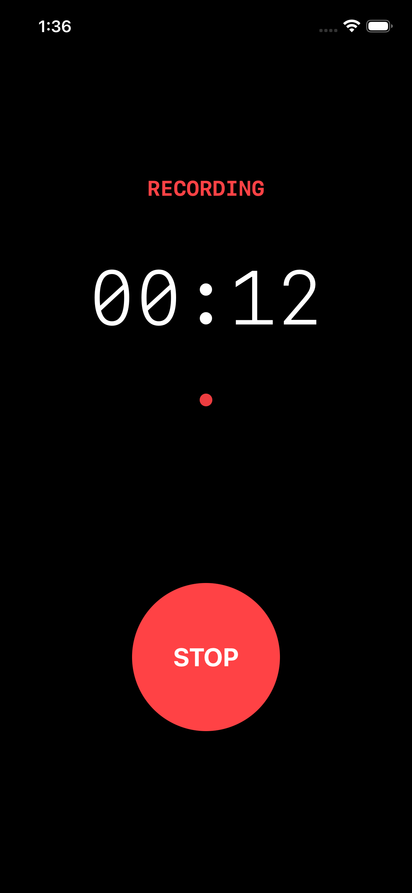
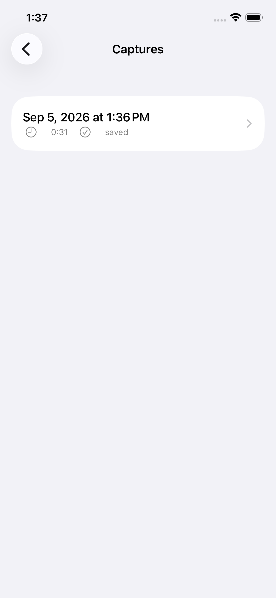

# Wake Capture

Audio capture app for iOS, built for the moment between sleep and awake. You arm it before bed, lock your phone, and when a thought hits at 3am you press one button on the lock screen to start recording. No unlocking, no navigating, no typing.

<p align="center">
  
  &nbsp;&nbsp;
  
  &nbsp;&nbsp;
  
</p>

## Why

Half-asleep ideas vanish in seconds. By the time you've unlocked your phone, opened Notes, and started typing, the thought is gone. Wake Capture skips all of that. One tap from the lock screen, speak, done. The recording saves locally and you deal with it in the morning.

## How it works

1. Open the app before bed, tap **Arm Wake Capture**
2. Lock your phone
3. When you wake up with something to say, hit the capture control (lock screen, action button, or Control Center)
4. Speak
5. Tap stop, or let the max-duration timer end it

Recordings are stored on-device as M4A files. No network connection required, no cloud sync, no account.

## Setup

Requires Xcode 26.3+ and [XcodeGen](https://github.com/yonaskolb/XcodeGen).

```bash
brew install xcodegen

cp Signing.xcconfig.example Signing.xcconfig
# Edit Signing.xcconfig and set your Apple Developer team ID

xcodegen generate
open WakeCapture.xcodeproj
```

The `.xcodeproj` isn't checked in; `project.yml` is the source of truth.

Deployment target is iOS 18.0 (required for WidgetKit Controls and `AudioRecordingIntent`).

## Project structure

```
WakeCapture/
  App/              App entry point, SwiftData container setup
  CaptureCore/      State machine, coordinator, session model
  Audio/            AVAudioSession + AVAudioRecorder wrappers
  Persistence/      SwiftData model, repository actor, file store
  SystemIntegration/
    Intents/        Start/Stop/Arm/Disarm intents, Siri phrases
    SharedCaptureCoordinator.swift
  UI/               SwiftUI views

WakeCaptureWidgets/   ControlWidget for lock screen / Control Center
WakeCaptureLiveActivity/  Live Activity UI shown during recording
WakeCaptureTests/     Unit tests with protocol-based mocks
```

## System entry points

The app registers a WidgetKit `ControlWidget` that works from the lock screen, Control Center, and the Action button on supported iPhones. `StartWakeCaptureIntent` conforms to `AudioRecordingIntent`, which tells iOS this app records audio and keeps a Live Activity running for the duration.

Siri shortcuts are registered for start, stop, arm, and disarm.

## Technical details

- Swift 6.0 with strict concurrency
- SwiftData for capture metadata
- Audio: AAC in M4A, 44.1 kHz, mono
- `CaptureCoordinator` is `@MainActor @Observable` (not an actor) so SwiftUI views can bind directly to state
- `CaptureRepository` is a `@ModelActor` for thread-safe persistence
- `AudioRecorder` sits behind an `AudioRecording` protocol; tests swap in mocks

Full spec lives in [`docs/SPEC.md`](docs/SPEC.md).

## License

[MIT](LICENSE)
